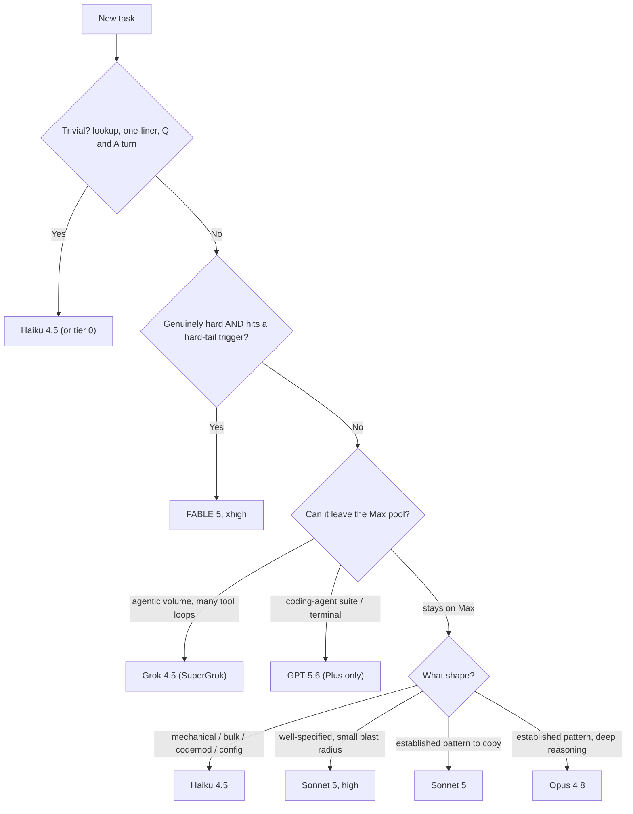

# Model routing — a worked example

This is **one author's real, filled-in instance** of the framework in
[`model-routing.md`](model-routing.md) — the machinery there, with actual models, subscriptions,
and quota economics plugged in. It is here to make the abstract concrete, not as a recommendation
to copy.

Two caveats, both load-bearing:

- **It dates.** Model names, benchmark numbers, quota rules, and tool versions below are true as
  of the dates they carry and go stale fast. The framework doesn't date; this does. That is
  exactly why the two are separate files.
- **It is a snapshot, not the source of truth.** The author's *live* policy lives in their
  private `~/.claude/` config and evolves there. This copy is frozen at publication and is not
  maintained in lockstep — read it as an illustration of *shape*, not as current fact.

Your own ladder will differ in every specific — different subscriptions, a different scarcest
resource, different models. The point is the *structure*: a scarcity gradient, two dials, an
apex reserved for the hard tail.

---

## The scarcity gradient (this author's)

The binding constraint here is **not dollars — it's a weekly allowance on the best model.** On
Claude Max, the apex model (Fable 5) draws from the same shared 5-hour and weekly pool as every
other Claude model *and* is hard-capped at 50% of the weekly limit. Spending it on beatable work
doesn't just cost money; it deletes the best model for the rest of the week. So the whole gradient
is oriented around keeping work *off* that pool.

```
0. Metered OpenRouter (via a multi-provider runtime) — models held on NO subscription
   (e.g. cheap open weights). Real dollars, but zero Claude-quota pressure.
1. Off-Max subscriptions — Grok 4.5 on SuperGrok Heavy · GPT-5.6 on ChatGPT Plus.
   (Native CLI or runtime-over-OAuth spends the identical bucket either way.)
2. Haiku 4.5  →  3. Sonnet 5  →  4. Opus 4.8  →  5. FABLE 5 (rationed apex, 50%/wk cap)
```

**Biggest lever: route a whole task to tier 0–1 so it never touches the Max pool at all.**

**Standing spend rule: GPT is never routed metered.** It runs on the ChatGPT Plus subscription
and nowhere else — not for load-shedding, not for volume, not when Plus is exhausted. If Plus runs
out, the task falls back to Grok or a Claude tier; it does not become a metered spend. Tier 0
exists for models held on *no* subscription, not as an overflow valve for subscribed ones.
(Decided 2026-07-23.)

## Dial 1 — capability tier

**FABLE (the apex) only when the work is genuinely hard AND ≥1 trigger fires:** novel
architecture / no prior art · high blast radius × low reversibility (migration, auth, concurrency,
money, data) · large-context integration with many interacting invariants at once (size alone is
not a trigger) · gnarly diagnosis after cheap fixes failed · long-horizon plan where an early
wrong turn compounds. **Precedence: a hard trigger wins** — it goes to Fable even when it would
also suit an off-Max bucket. Never trade correctness on hard work for quota.

Everything beneath that bar:

| Task shape | Route |
|---|---|
| established pattern to copy | Sonnet 5 |
| established pattern, deep reasoning | Opus 4.8 |
| well-specified, small blast radius | Sonnet 5, high effort |
| mechanical / bulk / codemod / config | Haiku 4.5 (or tier 0) |
| high agentic **volume** (many tool loops), off-Max | Grok 4.5 (SuperGrok) |
| coding-agent suites / terminal-heavy, off-Max | GPT-5.6 (Plus only) |

Why Fable earns the reservation: on saturated benchmarks the frontier is a 1–2 point pile-up, but
its advantage opens on the hard tail — SWE-bench Pro roughly **80% Fable vs ~69% Opus vs ~65%
Sol/Grok** (as of 2026-07-21). Reserve it where that ~15-point edge is real; use a cheaper tier
everywhere else.

## Dial 2 — effort

**Effort is a dial on Sonnet, Opus, and Fable only. Haiku has no effort setting** — passing
`--effort` to it is silently ignored, so tier is the only lever there.

- lookup / mechanical → low · well-specified → medium · standard/complex → high (Claude Code's
  default for Opus/Sonnet) · hardest architecture/debug → xhigh.
- Reasoning-deep but within a cheaper model's ceiling → raise EFFORT before tier (Sonnet@xhigh
  often beats Opus@medium for less scarce quota).
- Capability-hard but shallow → raise TIER, leave effort low.

A measured note from this repo's own build (2026-07-23, ~11 dispatches): per-turn latency stepped
cleanly by **tier** (~0.6s Haiku → ~3s Sonnet → ~5s Opus) while **effort barely moved it** — a
mid-tier task at *medium* landed dead-center of the *high* range. Wall-clock tracked **turn
count** (task scope), not effort. Practical upshot: to go faster, drop a tier or tighten the
brief; don't lower effort expecting speed — that only trades quality.

## Lever 2 — intra-session delegation ladder

**KEEP on the driver's model:** planning, architecture, diagnosis, integration decisions, final
review, judgment calls — anything needing the context the driver already holds.

**PUSH DOWN** (Agent tool `model: haiku|sonnet`, a runtime's task/smol subagents, a read-only
Explore agent): boilerplate of an already-designed piece · bulk edits/codemods · search & recon
fan-out · test and fixture scaffolding · routine docs. Test: self-contained + cheaply verifiable
→ push down; needs the driver's current reasoning → keep.

**SIDEWAYS:** a `codex:rescue` plugin hands a stuck / second-opinion / deep-diagnosis pass to GPT
off-Max without leaving Claude Code. A live per-turn advisor is runtime-only.

## Dial 3 — harness (capability, not billing)

The author drives models through three harnesses: **Claude Code** (native), **omp** (a
multi-provider runtime), and **codex** / **grok CLI** (other natives). Billing follows the *auth
path*, not the harness — omp OAuths into the same SuperGrok Heavy and ChatGPT Plus buckets the
native CLIs use — so for any subscribed model, native-vs-omp spends the identical bucket and the
choice is purely capability.

- **COMPONENT** (advisor / subagent / step inside another session) → omp; a native single-session
  CLI generally can't be embedded. The exception is `codex:rescue`, which hosts GPT inside
  Claude Code.
- **DRIVER** → native CLI for the newest model features and tightest tool-use fidelity; omp for
  live review, stale-patch rejection, cross-provider composition, or when supervised reliability
  matters more than the first-party edge.

### Off-Max workers under herdr supervision (versions verified 2026-07-23)

`grok CLI 0.2.106` (product "Grok Build", **stable** channel — 0.2.111 was already available,
so pin deliberately), `omp/17.0.5`, `codex-cli 0.144.5`.

- **GPT → codex** has the herdr status hook (v6). Supervisable hands-off.
- **Grok → omp-driving-Grok** is the reliable hands-off path (omp status hook, v5).
- **Grok → native grok CLI is *also* dispatchable hands-off:** `grok "<prompt>"` takes the prompt
  as a positional argument, bypassing the welcome screen that otherwise swallows first input
  (herdr reports `working` within ~6s and `--status idle` fires on completion). But it sits below
  omp-driving-Grok for unattended work: herdr supervises it only **heuristically** (`blocked`
  detection is untested, and a permissive permission mode can mask it), and **none of the
  Claude Code hygiene guards reach a non-Claude-Code process** — only the opt-in git-level
  `reference-transaction` hook does, and that is installed per repo. In a repo without it, a grok
  worker is unguarded against direct-on-main commits.

## The whole policy as a decision tree

Dial 1 as the branching decision. **Precedence:** the Fable branch wins even when an off-Max
bucket would also fit — never trade correctness for quota. GPT runs on ChatGPT Plus only and is
never metered; if Plus is exhausted the task falls to Grok or a Claude tier (see the scarcity
gradient above). The hard-tail triggers are listed in the Dial 1 section above.



Dials 2 and 3, and the separate execution question, as mappings:

```
DIAL 2 — EFFORT (independent; reasoning depth, NOT importance)
   Sonnet / Opus / Fable only. Haiku has no effort setting.
   lookup/mechanical → low · well-specified → medium
   standard/complex  → high · hardest architecture/debug → xhigh
   Reasoning-deep but within a cheaper model's ceiling → raise EFFORT before tier
   Capability-hard but shallow                         → raise TIER, leave effort low

DIAL 3 — HARNESS (capability only; subscribed models cost the same either way)
   COMPONENT inside another session → omp (exception: codex:rescue hosts GPT in Claude Code)
   DRIVER                           → native CLI: newest features, tool fidelity
                                      omp: live review, stale-patch reject, cross-provider

SEPARATE QUESTION — WHO EXECUTES / WHERE
   Not this policy. The git-hygiene tiers, keyed on DISCOVERY and VOLUME:
     know the exact change      → Tier 1  self-edit in a worktree
     needs discovery or volume  → Tier 2  worktree-isolated subagent
     real blast radius/parallel → Tier 3  dispatched herdr worker
   Model choice and execution locus are orthogonal.
```
